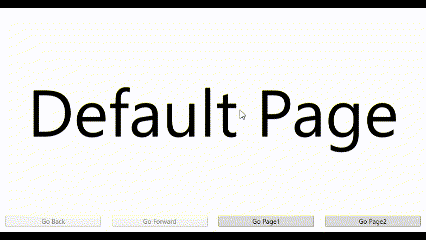

# AnimatedFrameクラス

アセンブリ : EnkuToolkit.Wpf

名前空間 : EnkuToolkit.Wpf.Controls

## 概要

画面遷移時にアニメーションを実行可能なFrameクラスの拡張

基本的な使用方法はWPFに標準搭載されているFrameクラスと同じですが

下記CLRプロパティが追加されており、それらを使用して画面遷移時に実行するアニメーションを

指定できるようになっています。

```c#
// 本ライブラリにすでに搭載されている標準のアニメーションを使用する際に
// 画面遷移時に実行するアニメーションの種類を指定するためのプロパティ
// 自作アニメーションを使用したりアニメーション実行をしたくない場合は
// nullを指定する。
// また、BuiltinAnimTypes型はenum値です。
public BuiltinAnimTypes? BuiltinAnimType { get; set; }
```

```c# 
// 自作の順方向画面遷移時のアニメーションをStoryboardで指定するためのプロパティ
// 上記BuiltinAnimTypeがnullではない場合、無視される。
// nullを指定すると順方向画面遷移時のアニメーションは実行されない。
public Storyboard? ForwardAnim { get; set; }
```

```c#
// 自作の逆方向画面遷移時のアニメーションをStoryboardで指定するためのプロパティ
// 上記BuiltinAnimTypeがnullではない場合、無視される。
// nullを指定すると逆方向画面遷移時のアニメーションは実行されない。
public Storyboard? BackwardAnim { get; set; }
```

現在本ライブラリに組み込まれている標準のアニメーションは

- Slidein 
- ModernSlidein

の二つのみです。

## 使用例

下記ファイル群はすべてプロジェクトのルートフォルダに配置してください。

DefaultPage.xaml

```xaml
<Page x:Class="MyApp.DefaultPage"
      xmlns="http://schemas.microsoft.com/winfx/2006/xaml/presentation"
      xmlns:x="http://schemas.microsoft.com/winfx/2006/xaml"
      xmlns:mc="http://schemas.openxmlformats.org/markup-compatibility/2006" 
      xmlns:d="http://schemas.microsoft.com/expression/blend/2008" 
      xmlns:local="clr-namespace:MyApp"
      mc:Ignorable="d" 
      d:DesignHeight="450" d:DesignWidth="800"
      Title="DefaultPage">

    <Viewbox>
        <Label Content="Default Page" />
    </Viewbox>
</Page>
```


Page1.xaml

```xaml
<Page x:Class="MyApp.Page1"
      xmlns="http://schemas.microsoft.com/winfx/2006/xaml/presentation"
      xmlns:x="http://schemas.microsoft.com/winfx/2006/xaml"
      xmlns:mc="http://schemas.openxmlformats.org/markup-compatibility/2006" 
      xmlns:d="http://schemas.microsoft.com/expression/blend/2008" 
      xmlns:local="clr-namespace:MyApp"
      mc:Ignorable="d" 
      d:DesignHeight="450" d:DesignWidth="800"
      Title="Page1">

    <Viewbox>
        <Label Content="Page1" />
    </Viewbox>
</Page>
```


Page2.xaml

```xaml
<Page x:Class="MyApp.Page2"
      xmlns="http://schemas.microsoft.com/winfx/2006/xaml/presentation"
      xmlns:x="http://schemas.microsoft.com/winfx/2006/xaml"
      xmlns:mc="http://schemas.openxmlformats.org/markup-compatibility/2006" 
      xmlns:d="http://schemas.microsoft.com/expression/blend/2008" 
      xmlns:local="clr-namespace:MyApp"
      mc:Ignorable="d" 
      d:DesignHeight="450" d:DesignWidth="800"
      Title="Page2">

    <Viewbox>
        <Label Content="Page2" />
    </Viewbox>
</Page>

```


MainWindow.xaml

```xaml
<Window x:Class="MyApp.MainWindow"
        xmlns="http://schemas.microsoft.com/winfx/2006/xaml/presentation"
        xmlns:x="http://schemas.microsoft.com/winfx/2006/xaml"
        xmlns:d="http://schemas.microsoft.com/expression/blend/2008"
        xmlns:mc="http://schemas.openxmlformats.org/markup-compatibility/2006"
        xmlns:local="clr-namespace:MyApp"
        xmlns:et="https://github.com/StdEnku/EnkuToolkit/Wpf/Controls"
        mc:Ignorable="d"
        Title="MainWindow" Height="450" Width="800">
    
    <DockPanel LastChildFill="True">
        <UniformGrid Columns="4" DockPanel.Dock="Bottom">
            <Button Content="Go Back" Margin="10" Click="GoBack" IsEnabled="{Binding ElementName=MainFrame, Path=CanGoBack}" />
            <Button Content="Go Forward" Margin="10" Click="GoForward" IsEnabled="{Binding ElementName=MainFrame, Path=CanGoForward}" />
            <Button Content="Go Page1" Margin="10" Click="GoPage1" />
            <Button Content="Go Page2" Margin="10" Click="GoPage2" />
        </UniformGrid>

        <et:AnimatedFrame Name="MainFrame"
                          Source="./DefaultPage.xaml"
                          BuiltinAnimType="ModernSlidein"
                          DockPanel.Dock="Top" />
    </DockPanel>
</Window>
```


MainWindow.xaml.cs

```csharp
namespace MyApp;

using System;
using System.Windows;

public partial class MainWindow : Window
{
    private readonly Uri _baseUri = new Uri("pack://application:,,,/", UriKind.Absolute);
    
    public MainWindow()
    {
        InitializeComponent();
    }

    private void GoBack(object sender, RoutedEventArgs e)
    {
        this.MainFrame.GoBack();
    }

    private void GoForward(object sender, RoutedEventArgs e)
    {
        this.MainFrame.GoForward();
    }

    private void GoPage1(object sender, RoutedEventArgs e)
    {
        var nextUri = new Uri(this._baseUri, "Page1.xaml");
        this.MainFrame.Navigate(nextUri);
    }

    private void GoPage2(object sender, RoutedEventArgs e)
    {
        var nextUri = new Uri(this._baseUri, "Page2.xaml");
        this.MainFrame.Navigate(nextUri);
    }
}
```




## アニメーションの自作例

上記サンプルのMainWindow.xaml内を下記のように修正してください。

```xaml
<Window x:Class="MyApp.MainWindow"
        xmlns="http://schemas.microsoft.com/winfx/2006/xaml/presentation"
        xmlns:x="http://schemas.microsoft.com/winfx/2006/xaml"
        xmlns:d="http://schemas.microsoft.com/expression/blend/2008"
        xmlns:mc="http://schemas.openxmlformats.org/markup-compatibility/2006"
        xmlns:local="clr-namespace:MyApp"
        xmlns:et="https://github.com/StdEnku/EnkuToolkit/Wpf/Controls"
        mc:Ignorable="d"
        Title="MainWindow" Height="450" Width="800">
    
    <DockPanel LastChildFill="True">
        <UniformGrid Columns="4" DockPanel.Dock="Bottom">
            <Button Content="Go Back" Margin="10" Click="GoBack" IsEnabled="{Binding ElementName=MainFrame, Path=CanGoBack}" />
            <Button Content="Go Forward" Margin="10" Click="GoForward" IsEnabled="{Binding ElementName=MainFrame, Path=CanGoForward}" />
            <Button Content="Go Page1" Margin="10" Click="GoPage1" />
            <Button Content="Go Page2" Margin="10" Click="GoPage2" />
        </UniformGrid>

        <et:AnimatedFrame Name="MainFrame"
                          Source="./DefaultPage.xaml"
                          DockPanel.Dock="Top">

            <et:AnimatedFrame.ForwardAnim>
                <Storyboard>
                    <DoubleAnimationUsingKeyFrames BeginTime="0:0:0"
                                       Storyboard.TargetName="CurrentTransform"
                                       Storyboard.TargetProperty="(et:NormalizedTransformContentControl.TranslateY)"
                                       FillBehavior="Stop">

                        <DiscreteDoubleKeyFrame KeyTime="0:0:0" Value="1" />
                        <EasingDoubleKeyFrame KeyTime="0:0:1" Value="0">
                            <EasingDoubleKeyFrame.EasingFunction>
                                <BounceEase EasingMode="EaseOut" />
                            </EasingDoubleKeyFrame.EasingFunction>
                        </EasingDoubleKeyFrame>
                    </DoubleAnimationUsingKeyFrames>

                    <DoubleAnimationUsingKeyFrames BeginTime="0:0:0"
                                       Storyboard.TargetName="OldTransform"
                                       Storyboard.TargetProperty="(et:NormalizedTransformContentControl.TranslateY)"
                                       FillBehavior="Stop">

                        <DiscreteDoubleKeyFrame KeyTime="0:0:0" Value="0" />
                        <EasingDoubleKeyFrame KeyTime="0:0:1" Value="-1">
                            <EasingDoubleKeyFrame.EasingFunction>
                                <BounceEase EasingMode="EaseOut" />
                            </EasingDoubleKeyFrame.EasingFunction>
                        </EasingDoubleKeyFrame>
                    </DoubleAnimationUsingKeyFrames>
                </Storyboard>
            </et:AnimatedFrame.ForwardAnim>

            <et:AnimatedFrame.BackwardAnim>
                <Storyboard>
                    <DoubleAnimationUsingKeyFrames BeginTime="0:0:0"
                                       Storyboard.TargetName="CurrentTransform"
                                       Storyboard.TargetProperty="(et:NormalizedTransformContentControl.TranslateY)"
                                       FillBehavior="Stop">

                        <DiscreteDoubleKeyFrame KeyTime="0:0:0" Value="-1" />
                        <EasingDoubleKeyFrame KeyTime="0:0:1" Value="0">
                            <EasingDoubleKeyFrame.EasingFunction>
                                <BounceEase EasingMode="EaseOut" />
                            </EasingDoubleKeyFrame.EasingFunction>
                        </EasingDoubleKeyFrame>
                    </DoubleAnimationUsingKeyFrames>

                    <DoubleAnimationUsingKeyFrames BeginTime="0:0:0"
                                       Storyboard.TargetName="OldTransform"
                                       Storyboard.TargetProperty="(et:NormalizedTransformContentControl.TranslateY)"
                                       FillBehavior="Stop">

                        <DiscreteDoubleKeyFrame KeyTime="0:0:0" Value="0" />
                        <EasingDoubleKeyFrame KeyTime="0:0:1" Value="1">
                            <EasingDoubleKeyFrame.EasingFunction>
                                <BounceEase EasingMode="EaseOut" />
                            </EasingDoubleKeyFrame.EasingFunction>
                        </EasingDoubleKeyFrame>
                    </DoubleAnimationUsingKeyFrames>
                </Storyboard>
            </et:AnimatedFrame.BackwardAnim>
        </et:AnimatedFrame>
    </DockPanel>
</Window>
```


