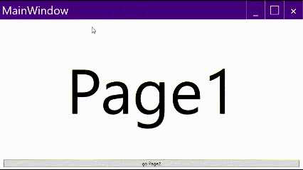

# CustomTitlebarAnimatedNavigationWindowクラス

アセンブリ : EnkuToolkit.Wpf

名前空間 : EnkuToolkit.Wpf.Controls

## 概要

タイトルバーをカスタマイズ可能な[AnimatedNavigationWindow](./AnimatedNavigationWindow-jp.md)クラス

FrameworkElement型のTitlebarプロパティを持ち、

そこにタイトルバーの内容を書いていく。

タイトルバーのサイズはTitlebarプロパティ内の

オブジェクトのHeightプロパティに依存する。


また、Titlebar内のボタン等はそのままではウィンドウ移動用の領域と認識されてしまい、

クリック等の操作ができないためTitlebarComponentsBehavior.IsHitTestVisible添付プロパティを

添付して、その値にtrueを指定してください。


## 使用例

下記ファイル群はすべてプロジェクトのルートフォルダに配置してください。


Page1.xaml

```xaml
<Page x:Class="MyApp.Page1"
      xmlns="http://schemas.microsoft.com/winfx/2006/xaml/presentation"
      xmlns:x="http://schemas.microsoft.com/winfx/2006/xaml"
      xmlns:mc="http://schemas.openxmlformats.org/markup-compatibility/2006" 
      xmlns:d="http://schemas.microsoft.com/expression/blend/2008" 
      xmlns:local="clr-namespace:MyApp"
      mc:Ignorable="d" 
      d:DesignHeight="450" d:DesignWidth="800"
      Title="Page1">

    <DockPanel LastChildFill="True">
        <Button Content="go Page2" DockPanel.Dock="Bottom" Margin="10" Click="Button_Click" />

        <Viewbox DockPanel.Dock="Top">
            <Label Content="Page1" />
        </Viewbox>
    </DockPanel>
</Page>
```


Page1.xaml.cs

```csharp
namespace MyApp;

using EnkuToolkit.Wpf.Controls;
using System;
using System.Windows.Controls;

public partial class Page1 : Page
{
    public readonly Uri _baseUri = new Uri("pack://application:,,,/", UriKind.Absolute);

    public Page1()
    {
        InitializeComponent();
    }

    private void Button_Click(object sender, System.Windows.RoutedEventArgs e)
    {
        var anw = (AnimatedNavigationWindow)App.Current.MainWindow;
        var nextUri = new Uri(this._baseUri, "Page2.xaml");
        anw.Navigate(nextUri);
    }
}
```


Page2.xaml

```xaml
<Page x:Class="MyApp.Page2"
      xmlns="http://schemas.microsoft.com/winfx/2006/xaml/presentation"
      xmlns:x="http://schemas.microsoft.com/winfx/2006/xaml"
      xmlns:mc="http://schemas.openxmlformats.org/markup-compatibility/2006" 
      xmlns:d="http://schemas.microsoft.com/expression/blend/2008" 
      xmlns:local="clr-namespace:MyApp"
      mc:Ignorable="d" 
      d:DesignHeight="450" d:DesignWidth="800"
      Title="Page2">

    <DockPanel LastChildFill="True">
        <Button Content="go back" DockPanel.Dock="Bottom" Margin="10" Click="Button_Click" />

        <Viewbox DockPanel.Dock="Top">
            <Label Content="Page2" />
        </Viewbox>
    </DockPanel>
</Page>
```


Page2.xaml.cs

```csharp
namespace MyApp;

using EnkuToolkit.Wpf.Controls;
using System.Windows.Controls;

public partial class Page2 : Page
{
    public Page2()
    {
        InitializeComponent();
    }

    private void Button_Click(object sender, System.Windows.RoutedEventArgs e)
    {
        var anw = (AnimatedNavigationWindow)App.Current.MainWindow;
        anw.GoBack();
    }
}
```


MainWindow.xaml

```xaml
<et:CustomTitlebarAnimatedNavigationWindow
        x:Class="MyApp.MainWindow"
        xmlns="http://schemas.microsoft.com/winfx/2006/xaml/presentation"
        xmlns:x="http://schemas.microsoft.com/winfx/2006/xaml"
        xmlns:d="http://schemas.microsoft.com/expression/blend/2008"
        xmlns:mc="http://schemas.openxmlformats.org/markup-compatibility/2006"
        xmlns:local="clr-namespace:MyApp"
        xmlns:et="https://github.com/StdEnku/EnkuToolkit/Wpf/Controls"
        mc:Ignorable="d"
        Title="MainWindow" Height="450" Width="800"
        Source="Page1.xaml"
        BuiltinAnimType="ModernSlidein">

    <et:CustomTitlebarAnimatedNavigationWindow.Titlebar>
        <Border Background="Indigo" Height="50">
            <UniformGrid Columns="2">
                <Label Foreground="White" FontSize="30" Content="{Binding RelativeSource={RelativeSource Mode=FindAncestor, AncestorType=Window}, Path=Title}" />

                <StackPanel Orientation="Horizontal" HorizontalAlignment="Right">
                    <StackPanel.Resources>
                        <Style TargetType="Button">
                            <Setter Property="Background" Value="Transparent" />
                            <Setter Property="Foreground" Value="White" />
                            <Setter Property="FontSize" Value="30" />
                            <Setter Property="Width" Value="50" />
                            <Setter Property="et:TitlebarComponentsBehavior.IsHitTestVisible" Value="True" />
                        </Style>
                    </StackPanel.Resources>

                    <Button Content="_" Click="MinimizeButtonClicked" />
                    <Button Content="□" Click="MaximizeButtonClicked" />
                    <Button Content="×" Click="ShutdownButtonClicked" />
                </StackPanel>
            </UniformGrid>
        </Border>
    </et:CustomTitlebarAnimatedNavigationWindow.Titlebar>
    
</et:CustomTitlebarAnimatedNavigationWindow>
```


MainWindow.xaml.cs

```csharp
namespace MyApp;

using EnkuToolkit.Wpf.Controls;
using System.Windows;

public partial class MainWindow : CustomTitlebarAnimatedNavigationWindow
{
    public MainWindow()
    {
        InitializeComponent();
    }

    private void ShutdownButtonClicked(object sender, RoutedEventArgs e)
    {
        App.Current.Shutdown();
    }

    private void MinimizeButtonClicked(object sender, RoutedEventArgs e)
    {
        this.WindowState = WindowState.Minimized;
    }

    private void MaximizeButtonClicked(object sender, RoutedEventArgs e)
    {
        var nextState = this.WindowState == WindowState.Maximized ? WindowState.Normal : WindowState.Maximized;
        this.WindowState = nextState;
    }
}
```




